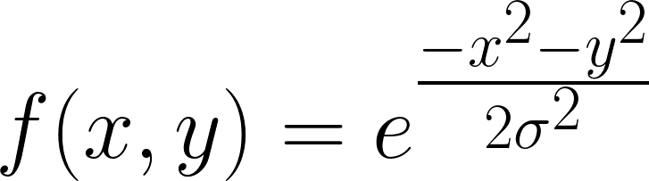
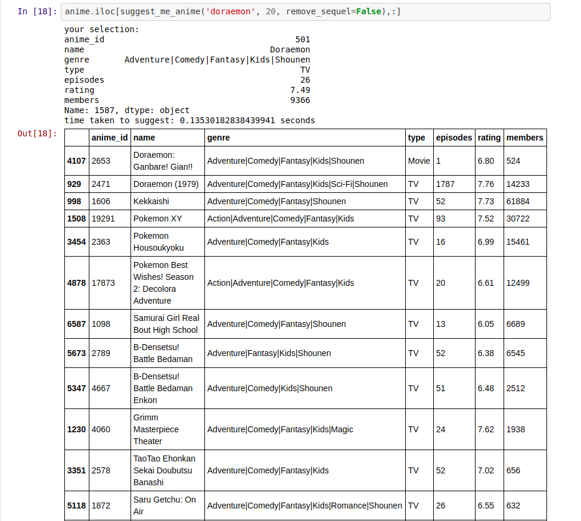
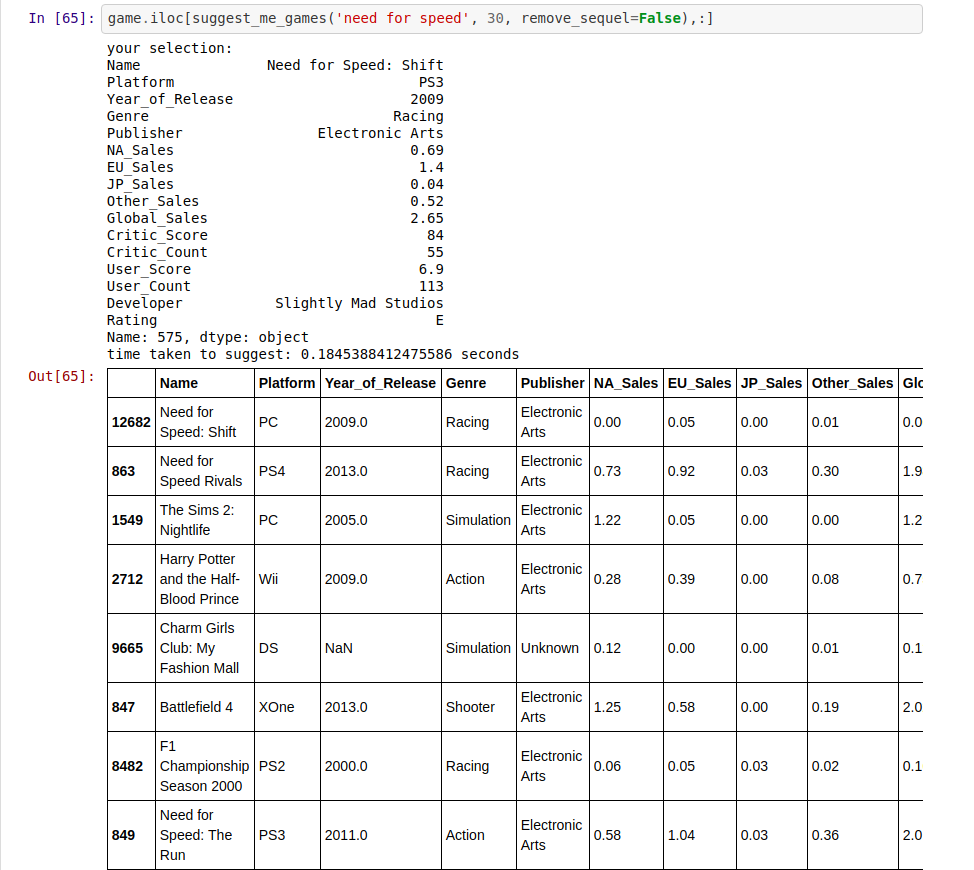
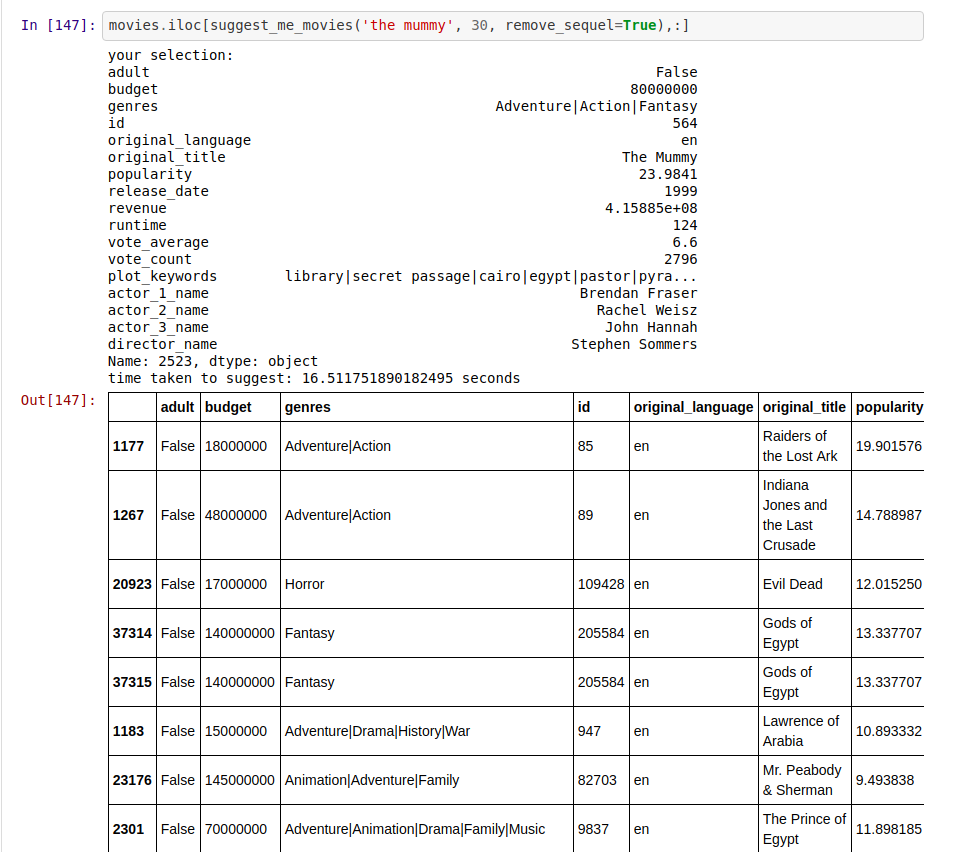

# Suggestion-Engine
Apply 2D Gaussian Filter on Gaussian Distribution to suggest Nearest Neighbors

Steps that I used:
1. Create augmentation dimension from genres, keywords, and etc.
2. Calculate Euclidean Distance.

3. Sort based on 2D Gaussian filter for ratings, user counts and etc.

4. Apply Gaussian Distribution to check distance between 2 points in the distribution.

### Suggestion from Anime, you can download the data-set [here](https://www.kaggle.com/CooperUnion/anime-recommendations-database)

### Suggestion from Game, you can download the data-set [here](https://www.kaggle.com/rush4ratio/video-game-sales-with-ratings)

### Suggestion from Movie, you can download the data-set [here](https://www.kaggle.com/rounakbanik/the-movies-dataset)

