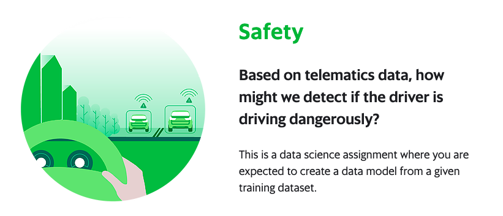

    

## How-to, original competition, https://www.aiforsea.com/safety

1. Download and unzip dataset using [dataset.ipynb](dataset.ipynb).

2. Preprocessing using [preprocessing.ipynb](preprocessing.ipynb).

3. Augmentation using [augmentation.ipynb](augmentation.ipynb).
