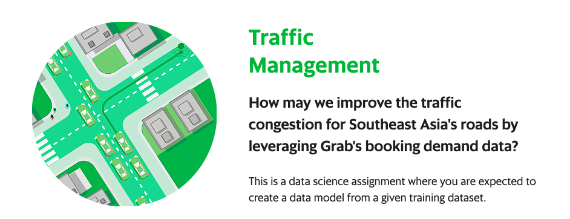

    

## How-to, original competition, https://www.aiforsea.com/traffic-management

1. Download and unzip dataset using [dataset.ipynb](dataset.ipynb).

2. Preprocessing and augmenting dataset using [preprocessing-augmentation.ipynb](preprocessing-augmentation.ipynb).

You might want to check up you might want to checkup [starting kit from Mahadir Ahmad](https://www.kaggle.com/mahadir/grab-traffic-demand-forecasting-starting-kit), it is really perfect. I copy pasted preprocessing from his notebook.

3. Train LGB model, from [lgb.ipynb](lgb.ipynb)

4. Train XGB model, from [xgb.ipynb](xgb.ipynb)

5. Bagging those results from trained models, from [bagging.ipynb](bagging.ipynb)

## To get better accuracy and less overfit on private dataset

1. Increase Kfolds inside [lgb.ipynb](lgb.ipynb), [xgb.ipynb](xgb.ipynb).

2. Reduce gamma inside [xgb.ipynb](xgb.ipynb).

3. Increase L2 normalization inside [lgb.ipynb](lgb.ipynb), [xgb.ipynb](xgb.ipynb).

4. Train more models, use vanilla gradient boosting from sklearn, or random forest, bagging the results.

5. Stack the results.
